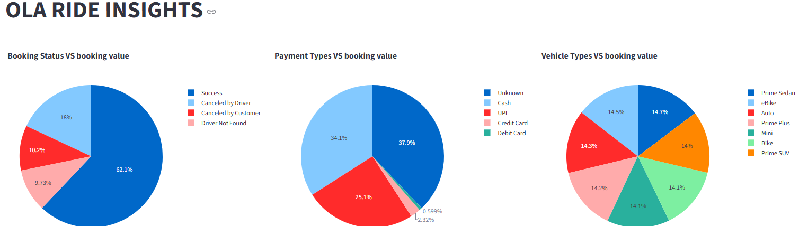

# OLARidesInsightsAnalysis
## Project Overview
    The rise of ride-sharing platforms has transformed urban mobility, offering convenience and affordability to millions of users.OLA a leading ride-hailing service, generates vast amounts of data related to ride bookings, driver availability, fare calculations, and customer preferences. However, deriving actionable insights from this data remains a challenge.

## Key Features
    Imported OLA Ride data into local PostgreSQL database.
    Created SQL queries
    Built Streamlit dashboards to visualize key metrics such as SuccessFul, Incompleted rides and Booking values and Ratings by Customers and Drivers
    Interactive bar charts, pie charts, and other visuals to make data-driven decisions easier.    
    Built with Python, Plotly, Pandas, and Streamlit
## Technologies Used
    | Tech       | Description                            |
    | ---------- | -------------------------------------- |
    | Python     | Core programming language              |
    | Pandas     | Data manipulation                      |
    | Plotly     | Interactive charts and choropleth maps |
    | Streamlit  | UI/dashboard framework                 |
    | Git/GitHub | Version control and collaboration      |
## Project Structure
            OLARIDEINSIGHTS/
        │
        ├── Cleaned_Data/ # Cleaned datasets in CSV and Excel formats
        │ ├── Cleaned_OLA_Data.csv
        │ └── Cleaned_OLA_Data.xlsx
        │
        ├── dataprocessing/ # Data cleaning and loading scripts
        │ ├── DataClean.py
        │ └── LoadData.py
        │
        ├── DBConnection/ # Database creation and SQL query scripts
        │ ├── init.py
        │ ├── DBCreation.py
        │ └── OlaInsightsSQLQuery.py
        │
        ├── env/ # Python virtual environment folder
        │ ├── etc/
        │ ├── Include/
        │ ├── Lib/
        │ ├── Scripts/
        │ └── share/
        │
        ├── ola_data/ # Raw or source data files
        │ └── OLA_DataSet.xlsx
        │
        ├── OlaRideInsightsApp.py # Main Streamlit application script
        ├── README.md # Project documentation and instructions
        └── pyvenv.cfg # Python environment configuration file

## Dpendencies installed and used
    pip install pandas
    pip install streamlit
    pip install sqlalchemy
    pip install psycopg2
    pip install matplotlib
    pip install plotly

## Built-in Modules Used
    import sys
    import os
    import requests
    import json
    import Repo    
 
## Step By Step Procudure

## Download The Raw data
   Downloaded and placed Raw data into the project folder
## Data Preprocessing and Manipulation
   OLA ride data are retrived and converted to DataFrames using python , Pandas
    sample code nippet:

                        datafeed = pd.ExcelFile(filePath)
                        july_df = datafeed.parse("July")

    Filling Null values:

                        july_df['Customer_Rating'].fillna(july_df['Customer_Rating'].mean(), inplace=True)
                        july_df['Driver_Ratings'].fillna(july_df['Driver_Ratings'].median(), inplace=True)
                        july_df['Payment_Method'].fillna('Unknown', inplace=True)

## DataFrames data moved to PostgreSQL tables
   These DataFrames converted to SQL tables under OlaRide_Insights Database
    code snippet:
                        engine = create_engine( f"postgresql+psycopg2://{self.DB_USER}:{self.DB_PASSWORD}@{self.DB_HOST}:{self.DB_PORT}/{self.DB_NAME}")
                        df = self.ola_df
                        df = self.setDataType(self.ola_df)
                        table_name = 'OLA_Ride_Data'   
## Data are retrieved based on SQL Questions asked
    SQL Queries created for given scenarios and results are stored in the DataFrames
        code snippet:
                        def __init__(self):
                            self.connection = psg.connect(
                                host="localhost",
                                database="OlaRide_Insights",
                                user="postgres",
                                password="root"
                            )
                            self.cursor = self.connection.cursor()

                        # 1. Retrieve all successful bookings:

                        def getAllSuccessfulBookings(self):
                            query = '''SELECT "Date","Booking_ID" ,"Booking_Status", "Customer_ID",  "Vehicle_Type",  "Pickup_Location", 
                                            "Drop_Location","Booking_Value", "Payment_Method","Ride_Distance", "Driver_Ratings", "Customer_Rating"
                                    FROM "OLA_Ride_Data"
                                    WHERE "Booking_Status" = 'Success'
                                    '''
                            self.cursor.execute(query)
                            rows = self.cursor.fetchall()
                            df = pd.DataFrame(rows,columns=["Date","Booking_ID" ,"Booking_Status", "Customer_ID",  "Vehicle_Type",  "Pickup_Location", 
                                                            "Drop_Location","Booking_Value", "Payment_Method","Ride_Distance", "Driver_Ratings", "Customer_Rating"])
                            return df
            
## streamlit application created
    streamlit application created to display the results as Dashboard with Barcharts, Tables, Piecarts.

## Sample Screenshot
     
   
